# App Stack for Java tutorial

In this tutorial we'll deploy a sample SpringBoot application using the stack.

## Prepare the code repository

In GitHub, fork the following repo: [oci-react-samples](https://github.com/oracle/oci-react-samples/tree/spring-appstack). Note that we will only used the branch "spring-appstack" for this tutorial.


If you don't already have Personal Token, create one and note it down. We'll use it in the next step.


## Create the compartment, vault and dynamic group in OCI

### Compartment

Create a compartment called "appstack". All the resources created by the stack will be created under this compartment. Note the compartment's OCID as it will be used later.

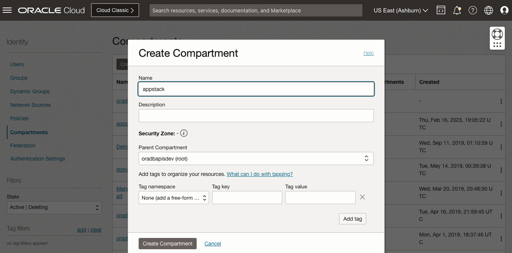

### Create a vault

Create a vault called "appstack":


Add a key called "appstack":


 ... and add the GitHub token as a secret.

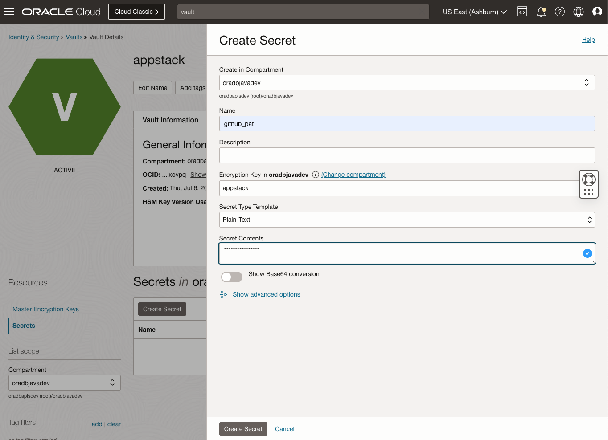

### Create the dynamic group

This dynamic group called "appstack" will match the DevOps resources needed to execute the build pipeline. This is where the compartment's OCID is needed:

```
All {resource.compartment.id = 'ocid1.compartment.oc1..............', Any {resource.type = 'devopsdeploypipeline', resource.type = 'devopsbuildpipeline', resource.type = 'devopsrepository', resource.type = 'devopsconnection', resource.type = 'devopstrigger'}}
```

ocid1.compartment.oc1..aaaaaaaajdsrhcul44hm25l3covur5hjs3sfcaek26inmjkntriwm2ee23ua

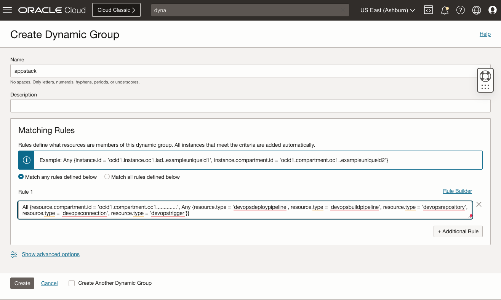

### Create the policy for this dynamic group

Create a new policy under the "appstack" compartment called "appstack"
```
Allow dynamic-group appstack to read secret-family in compartment appstack
Allow dynamic-group appstack to read devops-family in compartment appstack
```

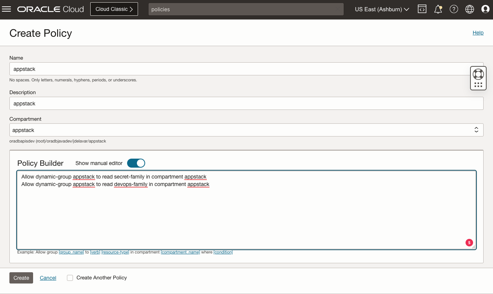

## Create project in DevOps

### Create a new project 

Create a new DevOps project called "appstacktutorial". This involves creating a topic "appstacktutorial".
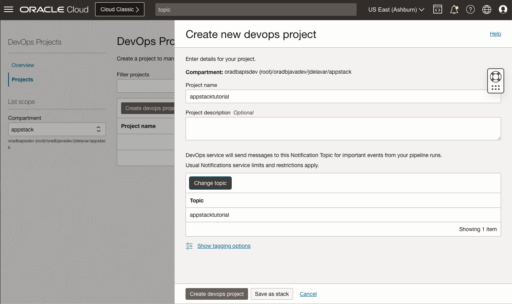

Be sure to turn on logging:


### Setup the connection to GitHub


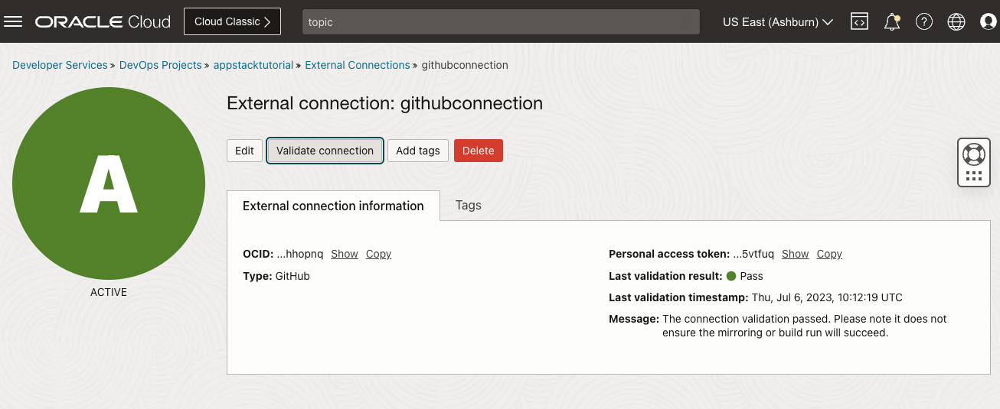

### Mirror the repo


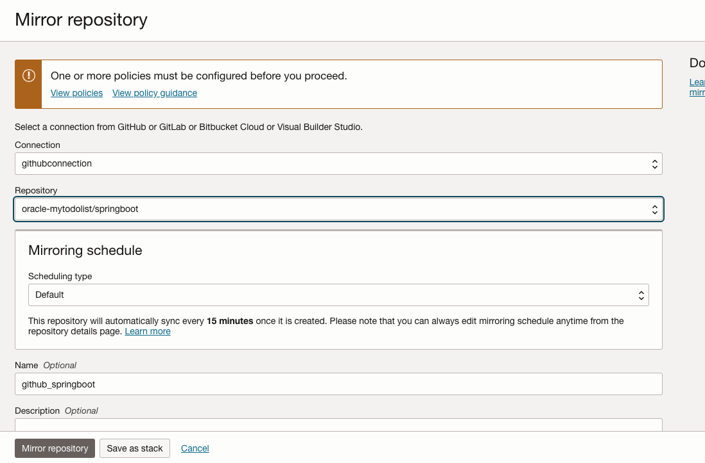

Your repo should now be created. Note its OCID as it will be used later.


## Configure the stack

Go to the [App Stack Product page](https://github.com/oracle-quickstart/appstack) and click on the "Deploy" button:


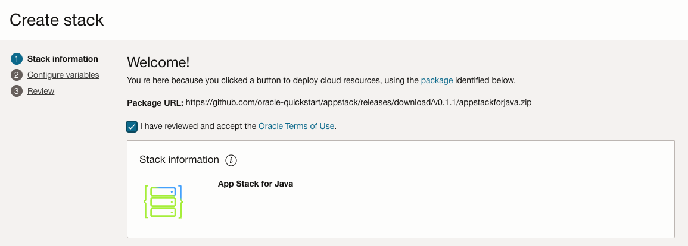

For the "DevOps repo", be sure to entre the right OCID. It should start with *ocid1.devopsrepository.* and the branch we're using is **spring-appstack**. The artifact **./target/mytodolist-0.0.1-SNAPSHOT.jar**.
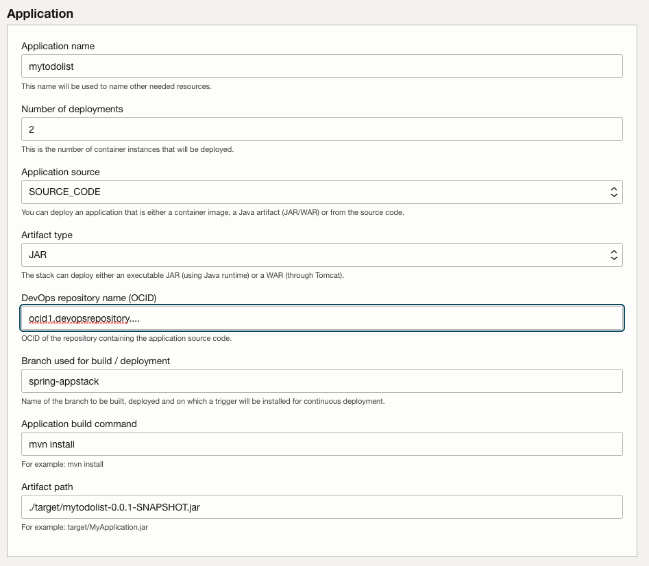


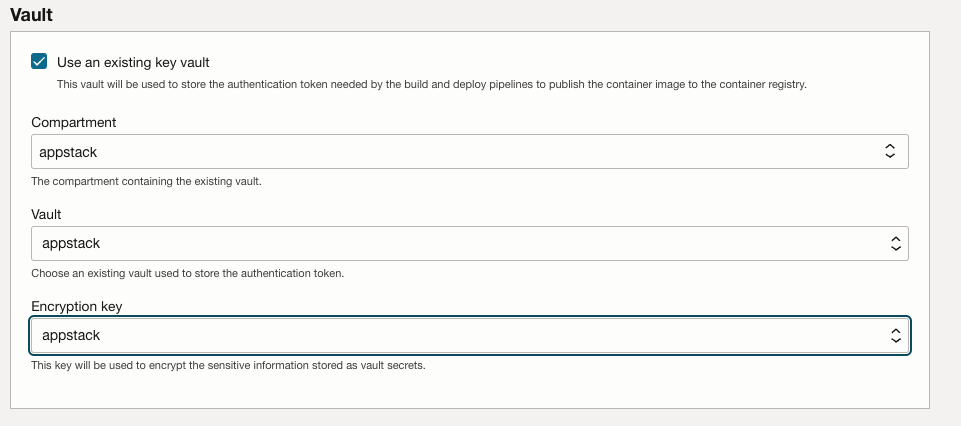
We're not creating any DNS record in this tutorial. If you have a domain name and you're using OCI to manage your DNS entries then you can choose to make the stack create a new record for the application by checking the checkbox below.


For the network we can keep the default values:
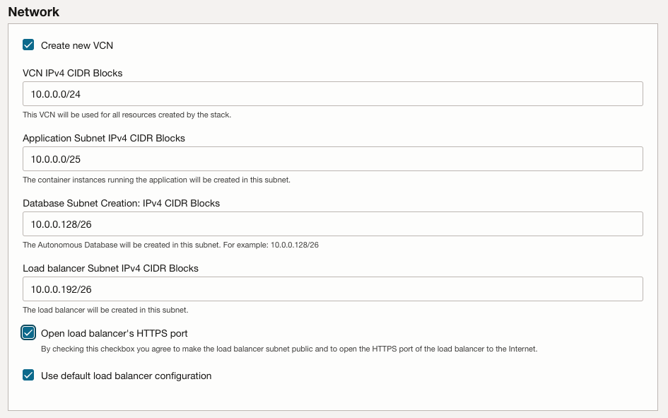

## Execute the stack

You can then apply the stack:


## Review the resources

It may take up to 10 minutes to execute the stack. You should then see this:
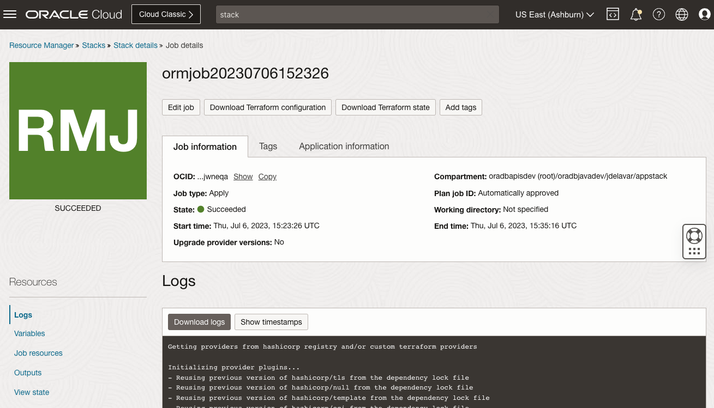

Your app URL will be displayed under "Application Information":
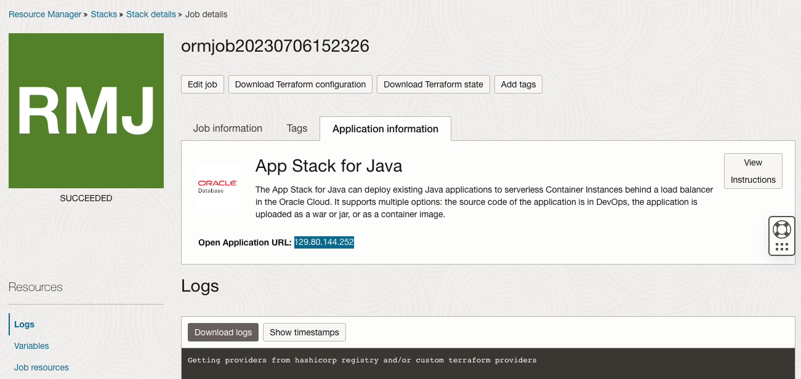

You can verify that the application is running:


The application exposes REST APIs to manage a todolist:
```
jdelavar@jdelavar-mac ~ % curl -X POST http://129.80.144.252/todolist -H 'Content-Type: application/json' -d '{"description":"Complete app stack tuto"}'
jdelavar@jdelavar-mac ~ % curl -s http://129.80.144.252/todolist | json_pp
[
   {
      "creation_ts" : "2023-07-06T15:47:35.341121Z",
      "description" : "Complete app stack tuto",
      "done" : false,
      "id" : 1
   }
]
```
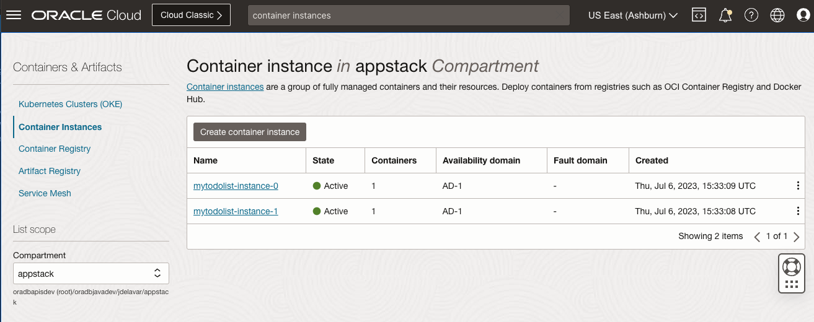
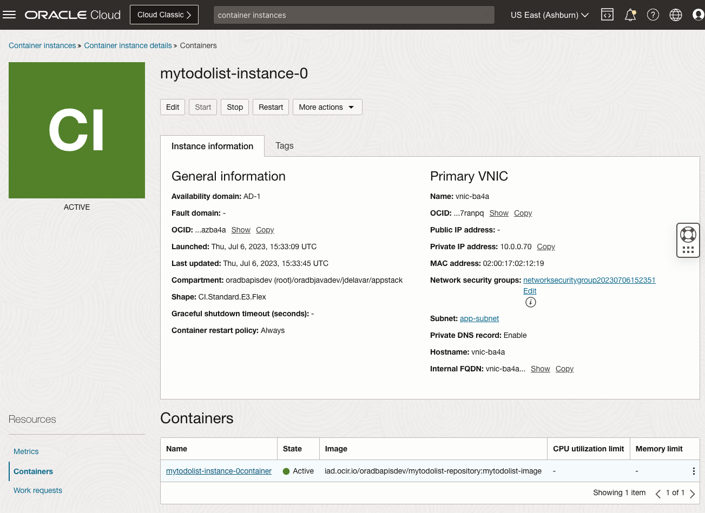

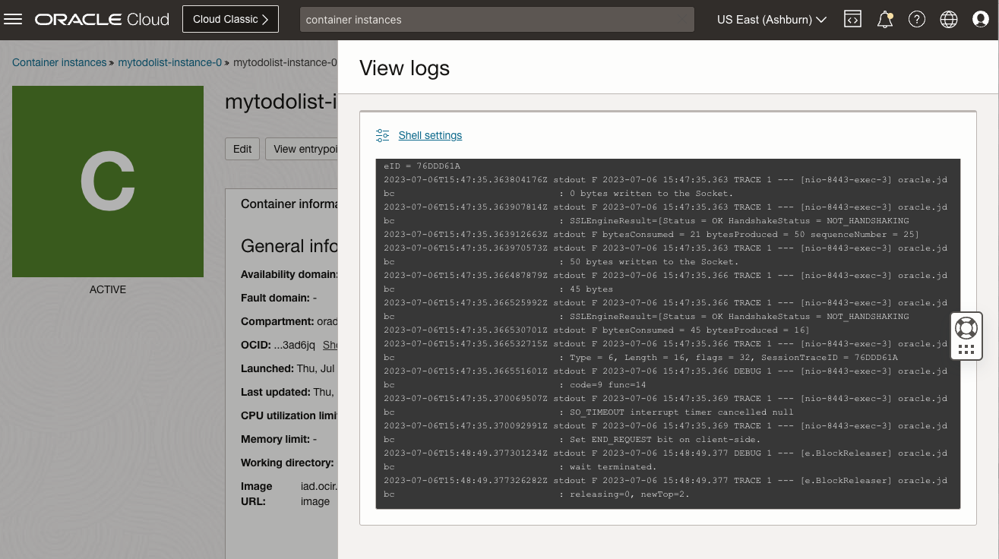
